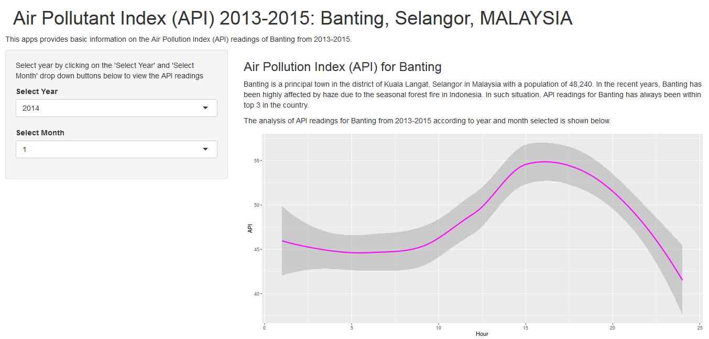

## Project Description

This apps provides basic information on the Air Pollution Index (API) readings of Banting from 2013-2015. Banting is principal town in the district of Kuala Langat, Selangor in Malaysia with a population of 48,240. API readings for Banting has always been within top 3 in the country.

Choose 'Select Year' and 'Select Month' below to view the API readings.



## Shiny Apps 
 
Click on this link to view the shiny apps:
https://aziahyahya.shinyapps.io/DevelopingDataProductProject/

The working files can be accessed via this link: https://github.com/aziahyahya/DevelopingDataProduct

The github repo consists of all the codes and data for the shiny apps as the following:

1. README.md
2. appFinal.R, ui.R and server.R 
3. presentation folder

##Summary of data
```{R}
banting<-read.csv("API_Banting.csv")
summary(banting)
```

